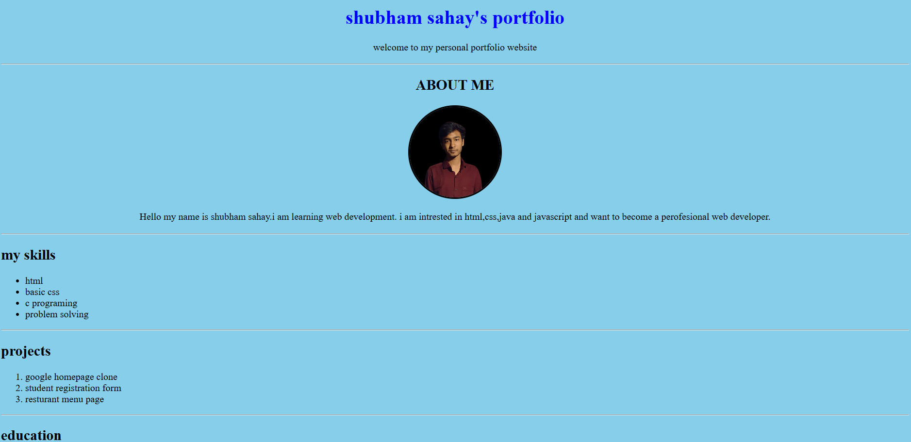
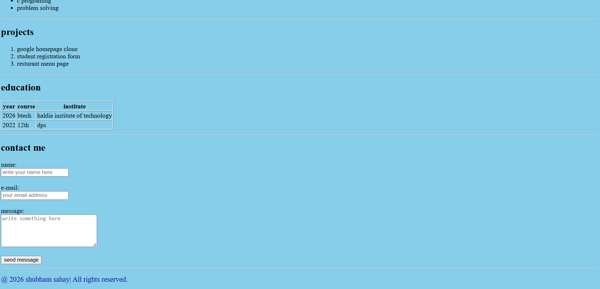

# 🌐 Personal Portfolio (HTML & CSS)

This is my personal portfolio website created using only HTML and CSS.

## 📌 About the Project
This project was built to practice frontend web development fundamentals and create a personal online portfolio.

## 🚀 Features
- Responsive layout
- About Me section
- Skills section
- Projects section
- Contact section
- Clean and simple design

## 🛠️ Technologies Used
- HTML5
- CSS3

## 📷 Preview

## 👨‍💻 Author
**Shubham Sahay**
